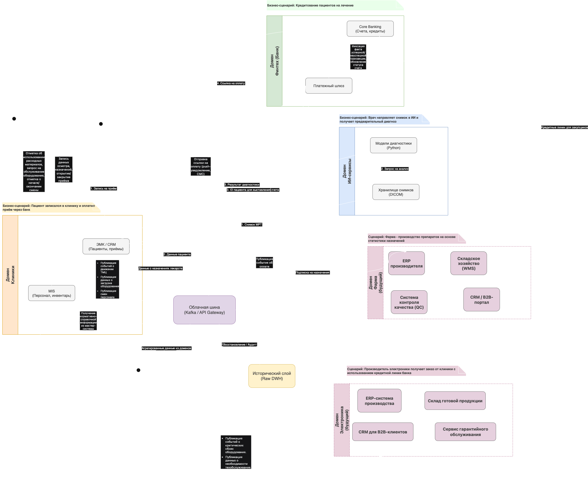

# Решение по доменному разделению и проектированию потоков данных для компании «Будущее 2.0»

## 1. Разделение системы на домены

### Целевая структура доменов

|Домен|Владелец домена|Основные данные|Бизнес-назначение|
|-|-|-|-|
|«Клиники»|Головной офис / Сеть клиник|Пациенты, персонал, инвентарь, расписание, приёмы, назначения|Операционная деятельность клиник, управление ресурсами, запись пациентов|
|«Финтех»|Банк (дочерняя компания)|Счета, кредиты, транзакции, платежи, финансовые продукты|Банковские услуги, кредитование пациентов, финансовые операции|
|«ИИ-сервисы»|ИИ-компания (дочерняя)|Медицинские снимки, результаты диагностики, обученные модели, предиктивная аналитика|Диагностика, поддержка принятия врачебных решений, анализ изображений|
|«Фарма» (будущий)|Фармацевтическая компания|Лекарства, поставки, остатки, сроки годности, закупки|Обеспечение лекарствами, логистика, управление аптечным складом|
|«Электроника» (будущий)|Производитель оборудования|Данные с устройств, телеметрия, калибровки, обслуживание|Мониторинг оборудования, профилактика поломок, интеграция с ИИ|
|«Исторические данные» (Core)|Централизованная команда данных|Сырые данные из всех источников, архив, неизменяемая история|Аудит, восстановление, загрузка данных в новые домены|

### Логика разделения

Разделение выполнено по принципу «границы бизнес-способностей» (Business Capabilities):

1. Связанность внутри домена: Внутри каждого домена данные сильно связаны по смыслу (например, счёт не может существовать без клиента банка, но может существовать без информации о том, какой врач вёл пациента).

2. Слабая связность между доменами: Домены обмениваются только ограниченным набором данных (например, Финтеху нужен только идентификатор пациента и сумма к оплате, но не нужна полная история болезни).

3. Соответствие оргструктуре: Каждый домен соответствует отдельному подразделению/купленной компании, что позволяет передать ответственность за данные бизнес-владельцам.

## 2. Data Flow Diagram (DFD)

Диаграмма потоков данных между доменами показывает, как бизнес-сценарии обеспечиваются движением данных.

### Описание ключевых потоков

1. Сценарий «Оплата медицинской услуги»:
    * Данные о пациенте из домена «Клиники» попадают в шину.
    * Финтех-домен забирает только идентификатор и сумму, выставляет счёт.
    * Пациент получает ссылку на оплату.
    * _Результат_: Интеграция без доступа банка к медицинской карте.

2. Сценарий «ИИ-диагностика»:
    * Медицинские снимки из клиники передаются в домен «ИИ-сервисы».
    * Модель возвращает результат (вероятность патологии) обратно в карту пациента.
    * _Результат_: Врач получает поддержку ИИ, данные снимков не покидают периметр ИИ-домена.

3. Сценарий «Подключение фармацевтики»:
    * Новый домен подписывается на события о выписке рецептов из шины.
    * На основе этих данных планирует закупки.
    * _Результат_: Фармкомпания интегрируется за неделю, не требуя изменений в DWH.

## 3. Аргументация и преимущества для бизнеса

Почему такое разделение оптимально?

1. Соответствие организационной структуре:
    * Банк управляет своим доменом «Финтех», клиники — своим. Это снимает конфликт интересов и ускоряет согласование изменений.
2. Изоляция чувствительных данных:
    * Медицинские снимки (тяжелые и чувствительные) остаются в домене ИИ. Финансовые данные — в домене банка. Шина передает только минимум, необходимый для взаимодействия.
3. Независимость стеков технологий:
    * ИИ-сервисы могут использовать Python и GPU-кластеры. Финтех — Java с высокой транзакционной безопасностью. Это никак не мешает друг другу.

Преимущества для бизнеса

|Преимущество|Как достигается|Влияние на бизнес|
|-|-|-|
|Ускорение вывода продуктов (Time-to-Market)|Команды не ждут изменений в центральном DWH. Банк может выпустить новый кредитный продукт за 2 недели, а не за 2 месяца.|Рост выручки за счет быстрого вывода финансовых услуг на рынок.|
|Независимость развития|ИИ-сервисы могут обновлять модели диагностики без риска сломать отчетность для клиник.|Повышение качества медицинских услуг (новые модели внедряются чаще).|
|Масштабируемость|Новый партнер (фарма, электроника) подключается через шину по единому стандарту, не создавая "каши" в данных.|Снижение затрат на интеграцию при покупке новых компаний.|
|Снижение нагрузки на DWH|DWH превращается в "холодное хранилище" для аудита. Оперативные отчеты идут из доменных витрин.|Отчеты строятся за минуты вместо часов. Быстрое принятие управленческих решений.|
|Безопасность и соответствие требованиям регуляторов|Медицинские и финансовые данные физически разделены, проще обеспечить соответствие требованиям (врачебная тайна, банковская тайна).|Снижение рисков штрафов и утечек.|
