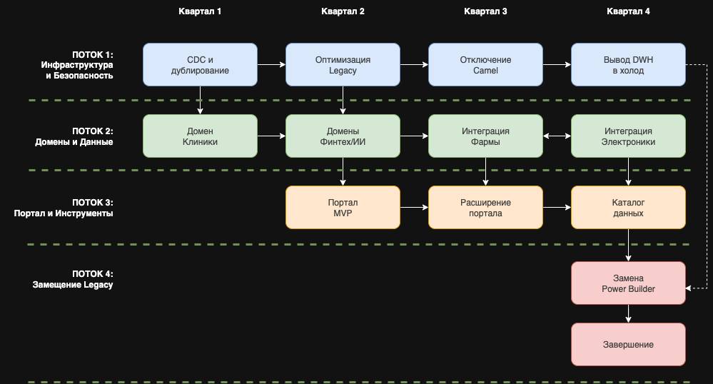

# Дорожная карта планируемых изменений в ИС компании "Будущее 2.0"

Карта разбита на 4 квартала (год) с привязкой к бизнес-целям.

## Этап 1: Базис и безопасность (Квартал 1)

|Шаг|Описание|Ответственные|Ресурсы|Ожидаемый результат|
|-|-|-|-|-|
|Аудит и изоляция Legacy DWH|Развертывание CDC-механизмов для захвата изменений из SQL Server 2008. Подготовка данных для миграции.|DWH-команда, Интеграционная команда|2 DevOps, 2 DWH-инженера|Данные из старой системы начинают дублироваться в облачное хранилище в реальном времени. Риск потери данных при сбое Legacy снижен.|
|Развертывание облачной шины|Установка и настройка Kafka (или Azure Event Hubs). Определение топиков и форматов событий.|Платформенная команда|3 инженера (интеграция), бюджет на облако|Появляется единая шина данных. Все новые интеграции идут только через нее.|
|Выделение первого домена ("Клиники")|Определение границ домена, создание первой витрины данных (пациенты, приёмы).|Команда клиник + Data Office|2 аналитика, 2 разработчика данных|Бизнес-пользователи получают первый быстрый отчет по загрузке клиник (вместо часов — минуты).|

_Связь с бизнесом_: Снижение рисков (уходим от legacy), первая быстрая победа для пользователей.

## Этап 2: Доменное управление и портал (Квартал 2)

|Шаг|Описание|Ответственные|Ресурсы|Ожидаемый результат|
|-|-|-|-|-|
|Создание доменов "Финтех" и "ИИ"|Развертывание витрин для банка и ИИ-сервисов. Определение политик доступа к данным.|Команды "Финтеха", ИИ, Data Office|По 2-3 инженера на домен|Домены работают независимо. "Финтех" перестает зависеть от DWH в части отчетности.|
|Запуск портала самообслуживания (MVP)|Развертывание каталога данных и базового конструктора отчетов. Подключение домена «Клиники».|Команда портала + Data Office|3 frontend, 2 backend, 1 аналитик|Сотрудники могут самостоятельно находить данные и строить простые отчеты без обращения в ИТ.|
|Миграция критичных отчетов|Переключение топ-10 самых тяжелых отчетов с прямых запросов к DWH на доменные витрины.|BI-команда, владельцы доменов|2 BI-разработчика|Снижение нагрузки на старое DWH. Ускорение формирования отчетов.|

_Связь с бизнесом_: Ускорение time-to-market для финтех-продуктов, прозрачность данных для бизнеса.

## Этап 3: Масштабирование и новые домены (Квартал 3)

|Шаг|Описание|Ответственные|Ресурсы|Ожидаемый результат|
|-|-|-|-|-|
|Интеграция "Фармы"|Подключение фармацевтической компании к шине. Создание витрины данных по производству и отгрузкам.|Команда "Фармы" + Платформа|3 инженера со стороны "Фармы", 1 от платформы|Фарма получает данные о потребностях клиник (рецепты) для планирования производства.|
|Интеграция "Электроники"|Подключение производителя медтехники к шине. Витрина по заказам и отгрузкам.|Команда "Электроники" + Платформа|3 инженера со стороны "Электроники", 1 от платформы|Сквозной процесс «заказ клиники — кредит банка — производство» работает в едином контуре.|
|Расширение портала|Добавление возможности заказа данных (data sharing agreements), система управления доступом (RBAC) на основе ролей.|Команда портала|2 разработчика|Безопасный обезличенный доступ к данным между доменами.|

_Связь с бизнесом_: Реальная интеграция купленных компаний, синергия между доменами (клиники заказывают оборудование у «своего» производителя).

## Этап 4: Замещение Legacy и оптимизация (Квартал 4)

|Шаг|Описание|Ответственные|Ресурсы|Ожидаемый результат|
|-|-|-|-|-|
|Вывод из эксплуатации Power Builder|Замена интерфейса оператора на современное веб-решение, интегрированное с новыми сервисами.|Команда разработки интерфейсов|4 разработчика, UX/UI-дизайнер|Снижение затрат на поддержку Legacy. Улучшение пользовательского опыта врачей.|
|Отключение Apache Camel|Перенос всех оставшихся потоков на новую шину. Демонтаж старой шины.|Интеграционная команда|2 инженера|Унификация интеграции, снижение стоимости поддержки двух параллельных шин.|
|Перевод DWH в режим "холодного хранилища"|Все оперативные отчеты идут из доменов. DWH остается только для аудита и исторических запросов.|DWH-команда|1 инженер|Снижение нагрузки на старое DWH, возможность его вывода в более дешевое хранилище.|

_Связь с бизнесом_: Снижение операционных затрат (OpEx), повышение надежности, завершение трансформации.

## Параллелизация процессов

### Детальное описание параллельных процессов

**Квартал 1**: Фундамент и быстрые победы

|Процесс|Действия|Результат|Пересечения|
|-|-|-|-|
|Поток 1: Инфраструктура|Развертывание CDC для SQL Server 2008. Настройка облачного хранилища для сырых данных.|Данные из Legacy дублируются в облако в реальном времени. Риски потери данных устранены.|→ Потоку 2: Сырые данные доступны для создания первого домена.|
|Поток 2: Домен "Клиники"|Определение границ домена. Создание первой витрины (пациенты, приёмы).|Бизнес получает первый быстрый отчет по загрузке клиник (минуты вместо часов).|← Потока 1: Использует данные из облачного хранилища.|
|Поток 3: Портал|Проектирование архитектуры портала. Выбор стека технологий.|Готовый план разработки MVP.|→ Потоку 2: Учитывает требования домена Клиники к витрине.|
|Поток 4: Legacy|Аудит текущих интерфейсов Power Builder.|Реестр экранов и функций для замещения.|Изолирован, но собирает требования.|

_Ключевое пересечение_: Успех Потока 2 (домен "Клиники") критически зависит от Потока 1 (качество и своевременность данных из CDC). Одновременный старт этих потоков обязателен.

**Квартал 2**: Масштабирование доменов и первый портал

|Процесс|Действия|Результат|Пересечения|
|-|-|-|-|
|Поток 1: Инфраструктура|Оптимизация производительности CDC. Настройка мониторинга.|Стабильный поток данных из Legacy в облако.|→ Потоку 2: Обеспечивает данные для новых доменов.|
|Поток 2: Домены "Финтех"/ИИ|Создание витрин для банка и ИИ-сервисов. Определение политик доступа.|"Финтех" и ИИ работают независимо от DWH. Ускорение вывода их продуктов.|↔ Потока 3: Домены выставляют API для портала.|
|Поток 3: Портал (MVP)|Разработка и запуск базовой версии портала. Подключение домена "Клиники".|Сотрудники могут самостоятельно строить простые отчеты.|← Потока 2: Требует от доменов готовых витрин. → Потоку 4: Определяет требования к новому интерфейсу.|
|Поток 4: Legacy|Миграция топ-10 тяжелых отчетов с DWH на доменные витрины.|Снижение нагрузки на старое DWH.|← Потока 3: Использует портал для валидации отчетов.|

_Ключевое пересечение_: Запуск портала (Поток 3) возможен только после того, как Поток 2 создаст хотя бы одну витрину. Поэтому старт Потока 2 должен опережать финиш Потока 3.

**Квартал 3**: Новые домены и расширение функциональности

|Процесс|Действия|Результат|Пересечения|
|-|-|-|-|
|Поток 1: Инфраструктура|Начало отключения Apache Camel. Перенос потоков на Kafka.|Унификация интеграции, снижение затрат на поддержку двух шин.|→ Потоку 2: Новая шина становится основой для обмена данными между доменами.|
|Поток 2: Интеграция "Фармы"|Подключение фармкомпании к шине. Создание витрины производства и отгрузок.|"Фарма" получает данные о реальной потребности в препаратах из клиник.|← Потока 1: Использует новую шину. ↔ Потока 2 ("Электроника"): Обмен данными о производственном оборудовании.|
|Поток 2: Интеграция "Электроники"|Подключение производителя медтехники к шине. Витрина заказов и отгрузок.|Сквозной процесс "заказ клиники — кредит банка — производство" в едином контуре.|← Потока 1: Использует новую шину. ↔ Потока 2 ("Фарма"): Синхронизация планов производства.|
|Поток 3: Расширение портала|Добавление каталога данных, системы управления доступом (RBAC).|Безопасный обезличенный доступ к данным между доменами.|← Потока 2: Получает метаданные от новых доменов.|
|Поток 4: Замещение Legacy|Начало разработки нового веб-интерфейса для операторов.|Прототип, готовый к тестированию.|← Потока 3: Использует API портала для унификации доступа.|

_Ключевое пересечение_: Интеграция "Фармы" и "Электроники" (Поток 2) идет параллельно, и они должны обмениваться данными друг с другом (например, электроника производит оборудование для фасовки лекарств). Это требует синхронизации их дорожных карт. Отключение Camel (Поток 1) создает окно возможностей для переключения новых доменов сразу на Kafka.

**Квартал 4**: Завершение трансформации

|Процесс|Действия|Результат|Пересечения|
|-|-|-|-|
|Поток 1: Инфраструктура|Перевод старого DWH в режим "холодного хранилища" (только для аудита).|Снижение затрат на содержание Legacy.|→ Потоку 4: Сигнал, что можно отключать зависимые системы.|
|Поток 2: Домены|Доработка витрин на основе обратной связи. Стандартизация Data Products.|Все домены работают в едином стандарте.|↔ Потока 3: Двусторонняя синхронизация метаданных.|
|Поток 3: Портал|Интеграция с системой управления доступом. Полноценный каталог данных.|Единая точка входа для всех данных компании.|← Потока 2: Потребляет все витрины.|
|Поток 4: Замещение Legacy|Замена Power Builder на новый веб-интерфейс. Отключение старого UI.|Современный интерфейс для операторов, снижение затрат на поддержку.|← Потока 3: Использует портал как бэкенд для данных.|

_Ключевое пересечение_: Завершающий этап требует синхронизации всех четырех потоков. Отключение Legacy (Поток 4) возможно только после того, как Поток 1 перевел DWH в безопасный режим, Поток 2 подтвердил готовность витрин, а Поток 3 предоставил интерфейс доступа.

### Матрица зависимостей между процессами

|Процесс|Зависит от|Влияет на|
|-|-|-|
|Поток 1 (Инфраструктура)|-|Поток 2, Поток 4|
|Поток 2 (Домены)|Поток 1|Поток 3, Поток 4|
|Поток 3 (Портал)|Поток 2|Поток 4|
|Поток 4 (Замещение Legacy)|Поток 1, Поток 2, Поток 3|-|

### Критические точки синхронизации (Milestones)

|Точка синхронизации|Время|Участники|Действие|
|-|-|-|-|
|S1: Данные готовы|Конец Q1|Поток 1 → Поток&nbsp;2|Передача первых стабильных данных из CDC в домен "Клиники"|
|S2: Первая витрина|Середина Q2|Поток 2 → Поток&nbsp;3|Домен "Клиники" открывает API для портала|
|S3: Запуск портала|Конец Q2|Поток 3 → Бизнес|Демонстрация работающего портала первым пользователям|
|S4: Новая шина|Начало Q3|Поток 1 → Поток&nbsp;2|Полный переход на Kafka, отключение Camel|
|S5: Все домены в контуре|Конец Q3|Поток 2 → Поток&nbsp;3|"Фарма" и "Электроника" подключены, витрины готовы|
|S6: Legacy отключен|Конец Q4|Поток 4 → Все|Power Builder заменен, старый DWH в режиме холодного хранения|

### Бизнес-обоснование параллелизма

1. Сокращение общего времени: Выполнение независимых работ одновременно сокращает общий срок трансформации с 2 лет до 1 года.
2. Ранние результаты: Бизнес видит первые улучшения (быстрые отчеты) уже в Q2, что поддерживает доверие к проекту.
3. Снижение рисков: Параллельное тестирование новых подходов (домены) и подстраховка Legacy (CDC) позволяет откатиться при необходимости.
4. Загрузка команд: Разные компетенции (инфраструктура, разработка, аналитика) задействованы одновременно, нет простоев.

## Обоснование планируемых изменений

Почему нужен именно такой порядок?

* **Этап 1** (_Базис_) — критичен для безопасности и начала движения:
Старая СУБД (SQL Server 2008) — это риск номер один. Безопасность данных и отказоустойчивость — базовые требования для медицинского и финансового бизнеса. Штрафы регуляторов за утечки или потерю данных могут быть катастрофическими. Поэтому первым делом мы дублируем данные в облако (через CDC) — страхуемся, но пока не ломаем работающую систему.  

* **Этап 2** (_Домены и портал_) — ускорение принятия решений:
Бизнес-пользователи (руководители клиник, финансовый отдел) должны увидеть результат. Создание первого домена «Клиники» и портала дает им отчет за минуты вместо часов. Это быстрая победа, которая создает кредит доверия к трансформации. Параллельно финтех и ИИ получают независимость — теперь они могут выкатывать свои продукты, не оглядываясь на общее DWH.  

* **Этап 3** (_Новые домены_) — реализация синергии:
Самый дорогой актив компании после покупки новых бизнесов (Фарма, Электроника) — это возможность перекрестных продаж и сквозных процессов. Чтобы производитель лекарств понимал, что реально назначают врачи, ему нужны данные из клиник. Чтобы производитель оборудования получал заказы с предодобренным кредитом, ему нужна связка с банком. Без этого этапа покупка новых компаний не дает эффекта синергии.  

* **Этап 4** (_Замещение Legacy_) — снижение затрат:
Содержать две параллельные инфраструктуры (старую и новую) дорого. Как только мы убедились, что новые сервисы работают стабильно и покрывают все сценарии, мы отключаем старое. Power Builder и Apache Camel требуют редких специалистов, которых дорого нанимать и удерживать. Замена их на современные технологии снижает операционные расходы (OpEx) и кадровые риски.  

|Этап|Влияние на бизнес|
|-|-|
|Этап 1|Снижение рисков (IT Risk) — защита от штрафов регуляторов|
|Этап 2|Ускорение принятия решений (Speed) — отчеты за минуты, быстрый вывод фич|
|Этап 3|Рост выручки (Revenue) — синергия между доменами, новые продукты|
|Этап 4|Снижение затрат (Cost) — уход от дорогого Legacy-поддержки|
